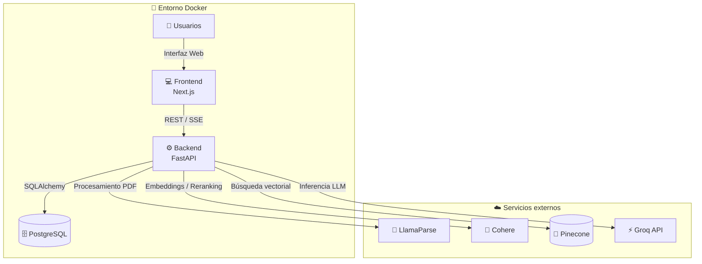
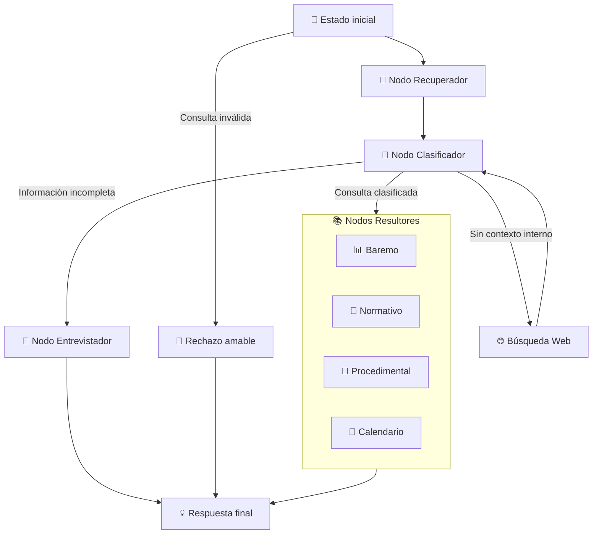
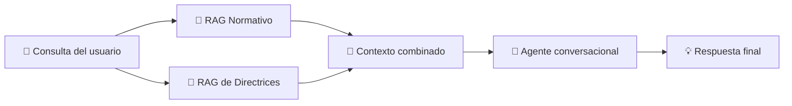
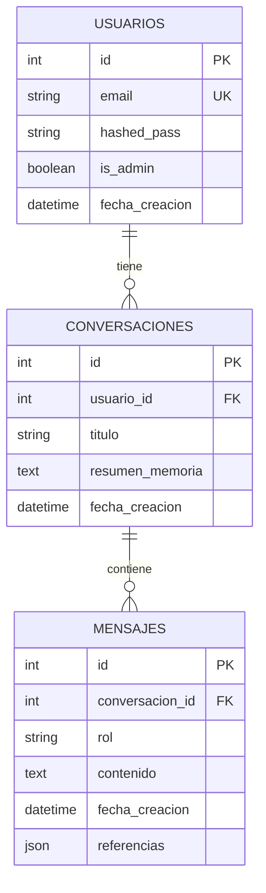

# 🎓🤖 Agente Conversacional con IA para la Gestión Burocrática en la Universidad de Sevilla

[](https://www.python.org/)
[](https://fastapi.tiangolo.com/)
[](https://www.langchain.com/)
[](https://www.docker.com/)
[](LICENSE)

Sistema de inteligencia artificial conversacional desarrollado como **Trabajo de Fin de Grado (TFG)** en la **Universidad de Sevilla**, concretamente en la **Escuela Técnica Superior de Ingeniería Informática**, para la automatización y resolución de consultas administrativas y normativas universitarias.

El sistema combina **LLMs, RAG, LangGraph y recuperación semántica** para proporcionar respuestas fundamentadas en documentación oficial de la Universidad de Sevilla.

---

## 📑 Índice

* [🎥 Demostración](#-demostración-del-sistema)
* [🎯 Objetivos](#-objetivos-del-proyecto)
* [🏗️ Arquitectura general](#️-arquitectura-general-del-sistema)
* [🧠 Arquitectura del agente](#-estructura-y-flujo-agéntico)
* [🔎 Sistema Dual RAG](#-sistema-dual-rag)
* [💾 Persistencia de datos](#-arquitectura-de-persistencia-de-datos)
* [📊 Evaluación y resultados](#-evaluación-y-resultados)
* [🛠️ Tecnologías](#️-tecnologías-utilizadas)
* [⚙️ Instalación](#️-instalación-y-despliegue-local)
* [☁️ Despliegue](#️-despliegue)
* [👨‍🎓 Autoría](#-créditos-y-autoría)

---

## 🎥 Demostración del sistema

> **Nota para evaluadores:** A continuación se puede consultar una demostración funcional del agente interactuando con la normativa y documentación universitaria.

▶️ **[Ver demostración en YouTube](https://youtu.be/-9qx3lD-xS0)**

---

## 🎯 Objetivos del proyecto

El objetivo principal del proyecto es desarrollar un **asistente conversacional inteligente basado en arquitecturas RAG** capaz de ayudar a estudiantes, docentes y candidatos a resolver consultas relacionadas con trámites y normativa de la Universidad de Sevilla.

Entre los principales objetivos técnicos se encuentran:

* 📄 Procesar documentación oficial, incluyendo documentos con estructuras complejas como tablas, anexos y notas al pie.
* 🧠 Implementar un agente conversacional basado en **LangGraph**.
* 🔀 Incorporar un sistema de **enrutamiento inteligente** mediante nodos especializados.
* 🔎 Implementar recuperación semántica mediante **RAG**.
* 🗂️ Separar el conocimiento normativo de las directrices de comportamiento mediante un sistema **Dual RAG**.
* ⚡ Mantener una latencia reducida mediante el uso de modelos optimizados para inferencia.
* 📊 Evaluar objetivamente la calidad de las respuestas mediante métricas de **RAGAS**.
* 🔍 Incorporar trazabilidad y observabilidad mediante **Langfuse**.

---

## 🏗️ Arquitectura general del sistema

El proyecto sigue una arquitectura desacoplada en la que los servicios principales se ejecutan mediante **Docker**, mientras que determinados servicios de IA y recuperación se consumen mediante APIs externas.



### Componentes principales

| Componente     | Tecnología           | Función                                            |
| -------------- | -------------------- | -------------------------------------------------- |
| Frontend       | Next.js + TypeScript | Interfaz web del asistente                         |
| Backend        | FastAPI              | API REST y comunicación mediante SSE               |
| Agente         | LangGraph            | Orquestación y control del flujo                   |
| LLM            | Groq                 | Inferencia de modelos de lenguaje                  |
| Ingesta        | LlamaParse           | Procesamiento de documentos PDF                    |
| Embeddings     | Cohere               | Representación vectorial de documentos y consultas |
| Reranking      | Cohere               | Reordenamiento de documentos recuperados           |
| Vector Store   | Pinecone             | Almacenamiento y recuperación semántica            |
| Base de datos  | PostgreSQL           | Usuarios, conversaciones y mensajes                |
| ORM            | SQLAlchemy           | Persistencia y acceso a PostgreSQL                 |
| Observabilidad | Langfuse             | Trazabilidad y monitorización                      |
| Contenedores   | Docker Compose       | Ejecución reproducible del entorno                 |

---

## 🧠 Estructura y flujo agéntico

El procesamiento de las consultas se realiza mediante un **grafo de estados dirigido**, donde cada nodo representa una operación especializada y las transiciones determinan el siguiente paso en función del contexto de la consulta.



### 🔎 Pipeline de recuperación

El **Nodo Recuperador** ejecuta un proceso híbrido de extracción e integración de contexto compuesto por varias fases:

1. **Búsqueda vectorial**

   * Recuperación de candidatos `Top-N` desde Pinecone.

2. **Fusión y reranking**

   * Reordenamiento de los documentos recuperados.
   * Aplicación de estrategias de recuperación híbrida y **Cohere Rerank** para mejorar la precisión.

3. **Inyección de contexto**

   * Combinación de directrices estáticas con el contexto dinámico extraído de la conversación.

4. **Enrutamiento**

   * El contexto recuperado se utiliza posteriormente para determinar el nodo especializado que debe procesar la consulta.

---

## 🔎 Sistema Dual RAG

Una de las características principales del proyecto es la utilización de un sistema **Dual RAG**, diseñado para separar dos tipos de conocimiento:



### 📜 RAG Normativo

Contiene información procedente de la documentación oficial de la Universidad de Sevilla y permite recuperar información relacionada con:

* Normativa académica.
* Procedimientos administrativos.
* Calendarios y plazos.
* Baremos.
* Tasas y permanencia.
* Documentación institucional.

### 📘 RAG de Directrices

Contiene directrices relacionadas con el comportamiento y estilo de respuesta del agente, permitiendo separar las reglas de interacción del conocimiento normativo.

---

## 💾 Arquitectura de persistencia de datos

La persistencia se implementa mediante **PostgreSQL**, utilizando **SQLAlchemy** como ORM.

El modelo permite gestionar:

* 👤 Usuarios.
* 💬 Conversaciones.
* 📨 Mensajes.
* 🧠 Memoria contextual.
* 🔗 Referencias asociadas a las respuestas.
* 📝 Historial de interacción.



---

## 📊 Evaluación y resultados

El sistema fue evaluado mediante una **batería de 50 casos de uso**, utilizando técnicas de evaluación basadas en **LLM as a Judge** y métricas de **RAGAS**.

Además, se incorporó **Langfuse** para obtener trazabilidad y observabilidad de las ejecuciones.

### Resultados principales

| Métrica                        |    Resultado |
| ------------------------------ | -----------: |
| 🎯 Precisión de intención      | **100,00 %** |
| 🗂️ Precisión de categoría     |  **68,00 %** |
| 📖 Fidelidad (*Faithfulness*)  |  **80,00 %** |
| 💬 Relevancia de respuesta     |  **62,10 %** |
| ⚡ Latencia media de inferencia |   **9,85 s** |

Estos resultados muestran que el sistema consigue mantener una **alta precisión en la identificación de la intención**, junto con una latencia inferior al objetivo técnico establecido para el sistema.

---

## 🛠️ Tecnologías utilizadas

### 🤖 Inteligencia Artificial

* **Python 3.10+**
* **LangChain**
* **LangGraph**
* **Groq API**
* **LlamaParse**
* **Cohere**
* **RAG / Dual RAG**
* **RAGAS**

### 🔎 Recuperación de información

* **Pinecone**
* Embeddings multilingües de Cohere
* Cohere Rerank
* Recuperación semántica

### ⚙️ Backend

* **FastAPI**
* **SQLAlchemy**
* REST API
* Server-Sent Events (**SSE**)
* JWT para autenticación

### 💻 Frontend

* **Next.js**
* **React**
* **TypeScript**
* **TailwindCSS**

### 🗄️ Persistencia

* **PostgreSQL**

### 📈 Observabilidad

* **Langfuse**

### 🐳 Infraestructura

* **Docker**
* **Docker Compose**

---

# ⚙️ Instalación y despliegue local

## 📋 Requisitos previos

Antes de ejecutar el proyecto es necesario disponer de:

* 🐳 **Docker** y **Docker Compose** instalados.
* 🔑 Claves de API activas para:

  * Groq
  * Cohere
  * Pinecone
  * LlamaParse
  * Langfuse

---

## 1️⃣ Clonar el repositorio

Clona el repositorio y accede al directorio del proyecto:

```bash
git clone https://github.com/kevamacal/TFG-agente-ayuda-burocracia-US.git
cd TFG-agente-ayuda-burocracia-US
```

---

## 2️⃣ Configurar las variables de entorno

Crea un archivo `.env` en la raíz del proyecto.

### 🗄️ Backend y base de datos

```env
DATABASE_URL=postgresql://postgres:postgres@db:5432/tfg_db
SECRET_KEY=tu_clave_secreta_jwt
```

### 🤖 Servicios de IA y Vector Stores

```env
GROQ_API_KEY=tu_clave_groq
COHERE_API_KEY=tu_clave_cohere
PINECONE_API_KEY=tu_clave_pinecone
LLAMAPARSE_API_KEY=tu_clave_llamaparse
```

### 📈 Observabilidad — Langfuse

```env
LANGFUSE_PUBLIC_KEY=tu_public_key
LANGFUSE_SECRET_KEY=tu_secret_key
LANGFUSE_HOST=https://cloud.langfuse.com
```

> ⚠️ **Importante:** Sustituye los valores de ejemplo por tus propias credenciales y **no subas el archivo `.env` al repositorio**.

---

## 3️⃣ Levantar el entorno con Docker Compose

Una vez configuradas las variables de entorno, ejecuta:

```bash
docker-compose up --build -d
```

Este comando:

1. Construye las imágenes necesarias.
2. Crea los contenedores.
3. Levanta los servicios.
4. Ejecuta el entorno en segundo plano mediante `-d`.

---

## 4️⃣ Acceder a la aplicación

Una vez iniciados correctamente los contenedores, los servicios estarán disponibles en:

| Servicio             | URL                        |
| -------------------- | -------------------------- |
| 💻 Frontend          | http://localhost:3000      |
| ⚙️ Backend / API     | http://localhost:8000      |
| 📚 Swagger / OpenAPI | http://localhost:8000/docs |

### 📚 Documentación de la API

La documentación interactiva de Swagger permite consultar y probar los endpoints disponibles en el backend.

➡️ **[Abrir Swagger](http://localhost:8000/docs)**

---

## 🛑 Detener el entorno

Para detener los contenedores:

```bash
docker-compose down
```

Si además se desea reconstruir completamente el entorno después de realizar cambios:

```bash
docker-compose down
docker-compose up --build -d
```

---

# ☁️ Despliegue

El proyecto contempla también un despliegue en la nube mediante **Render**.

### 🌐 Servicios desplegados

| Servicio    | URL                                                                                                 |
| ----------- | --------------------------------------------------------------------------------------------------- |
| 💻 Frontend | [agente-us.onrender.com](https://agente-us.onrender.com/)                                           |
| ⚙️ Backend  | [tfg-agente-ayuda-burocracia-us.onrender.com](https://tfg-agente-ayuda-burocracia-us.onrender.com/) |

> ℹ️ El despliegue permite acceder al frontend y al backend sin necesidad de ejecutar el entorno Docker localmente.

---

# 📚 Estructura del proyecto

De forma conceptual, el proyecto se organiza en los siguientes componentes:

```text
TFG-agente-ayuda-burocracia-US/
│
├── backend/
│   ├── api/
│   ├── agent/
│   ├── database/
│   ├── ingestion/
│   ├── rag/
│   └── ...
│
├── frontend/
│   ├── app/
│   ├── components/
│   ├── public/
│   └── ...
│
├── docker-compose.yml
├── .env
├── .gitignore
└── README.md
```

> La estructura anterior representa la organización conceptual del proyecto. La estructura exacta puede variar según la versión actual del repositorio.

---

# 📖 Documentación

Para obtener información detallada sobre el análisis, diseño, implementación y evaluación del sistema, se puede consultar la **memoria completa del TFG**.

La memoria aborda, entre otros aspectos:

* 📋 Análisis de requisitos.
* 🏗️ Diseño de la arquitectura.
* 🧠 Diseño e implementación del agente.
* 🔎 Sistema Dual RAG.
* 📄 Pipeline de ingesta documental.
* 💬 Gestión de memoria conversacional.
* 🌐 Implementación del frontend.
* 📊 Estrategia de evaluación.
* 🧪 Resultados experimentales.
* 🚀 Trabajo futuro.

---

# 🎓 Créditos y autoría

### 👨‍💻 Autor

**Kevin Amador Calzadilla**

### 👨‍🏫 Tutores

* **José Enrique Sánchez López**
* **Pablo Reina Jiménez**

### 🏛️ Información académica

| Campo                | Información                                               |
| -------------------- | --------------------------------------------------------- |
| **Titulación**       | Grado en Ingeniería Informática — Ingeniería del Software |
| **Departamento**     | Lenguajes y Sistemas Informáticos                         |
| **Centro**           | Escuela Técnica Superior de Ingeniería Informática        |
| **Universidad**      | Universidad de Sevilla                                    |
| **Curso académico**  | 2025/2026                                                 |
| **Convocatoria**     | Segunda convocatoria                                      |
| **Fecha de lectura** | 6 de julio de 2026                                        |

---
